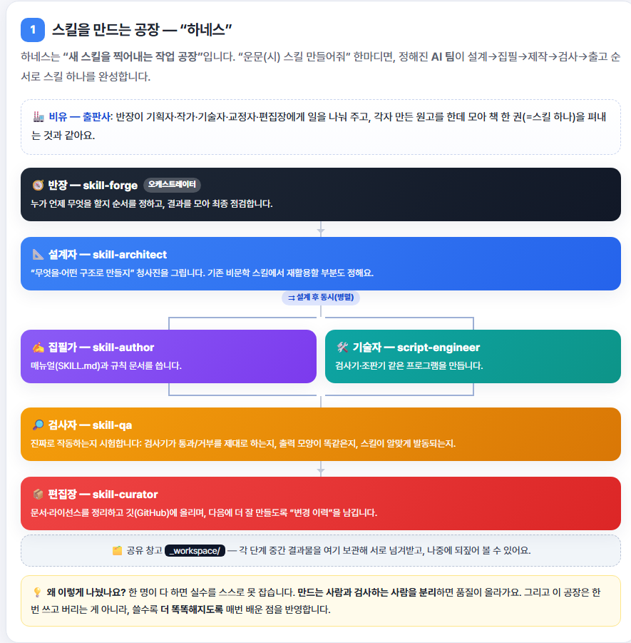
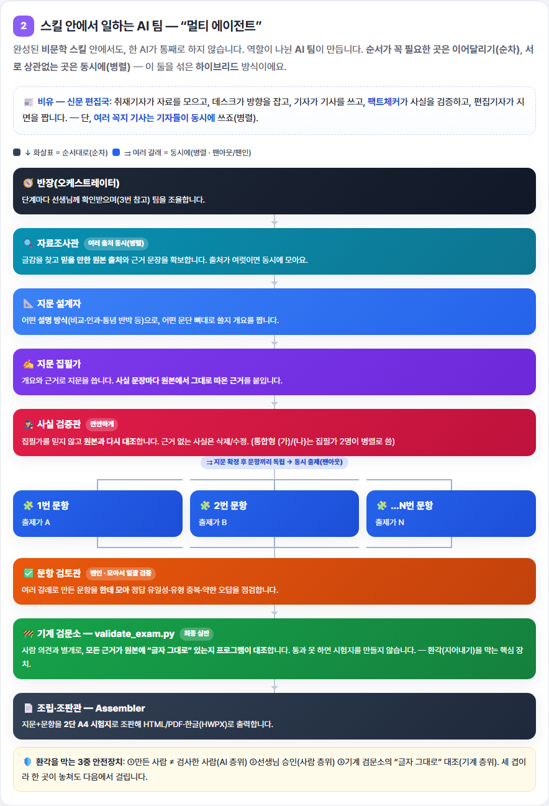
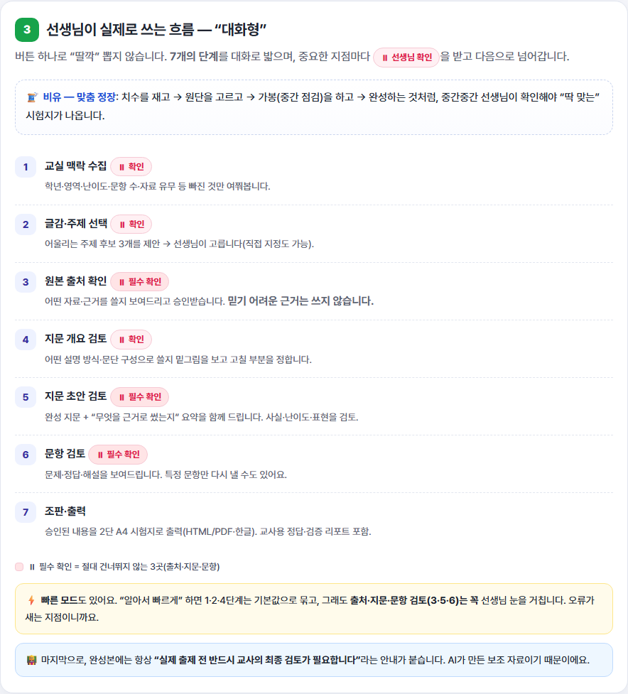

# korean-exam-writer — 수능 국어 시험지 생성 스킬 패밀리

중·고등학교 국어 교사가 **자신이 구독한 Claude/GPT**로 수능 국어 지문·문항·해설을 만드는
Claude Agent Skill. 서버·DB·API 키 없이 교사의 모델로 실행한다.

> 이 저장소는 **`korean-bimunhak-exam`을 이어받아 이름을 바꾼 것**이다(스타·포크·이슈 유지, 옛 URL 자동 리다이렉트).
> 비문학 단일 스킬에서 **비문학 + 운문 2스킬 패밀리**로 확장했다.

| 스킬 | 대상 | 상태 |
|---|---|---|
| **`korean-bimunhak-exam-writer`** | 비문학(독서) — 인문·사회·과학·기술·예술 | 안정 |
| **`korean-unmun-exam-writer`** | 운문 — 현대시·고전시가·갈래복합 | 신규 |
| `korean-sanmun-exam-writer` | 산문 — 소설·극·수필 | 미착수 |

두 스킬은 **스키마·검증기·조판기를 공유**한다(`plugins/korean-exam-writer/scripts/`).
운문은 비문학의 설계를 상속하고 네 지점만 바꾼다 —
[`20-verse-adaptation.md`](plugins/korean-exam-writer/skills/korean-unmun-exam-writer/references/20-verse-adaptation.md)가 그 단일 목록이다.

## 핵심 원칙 (P0) — 환각·오류 금지

모든 사실은 근거의 **축자(글자 그대로) 인용**을 달고, `validate_exam.py`가 그것이 원자료의
**실제 부분문자열**인지 기계로 검증한다. 근거를 못 대는 사실은 삭제, 지문이 성립 안 되면 거부.
완성본에는 교사용 검증 리포트 + "최종 검토 필요" 고지를 붙인다.

### 기계 게이트

| 게이트 | 무엇을 막는가 | 독서 | 운문 |
|---|---|:--:|:--:|
| **H1** 축자 인용 | 사실 날조. 운문에서는 **작품 오인용** | ✔ | ✔ |
| **H5** 오답 반증 인용 | "그럴듯하기만 한" 약한 오답 | ✔ | ✔ |
| **H6** 인용–해석 분리 | 인용은 맞는데 **읽기에 근거가 없는** 감상 문항 | — | ✔ |
| **H7** 저작권 근거 | 보호 중인 작품을 근거 없이 수록 | — | ✔ |
| 역할 도메인 검사 | 시를 설명문 구조로 읽기 | ✔ | ✔ |
| **L3** 유일성 프로브 | **복수정답** | ✔ | ✔ |

**L3가 잡는 것** — H5는 "각 오답이 지문으로 *반증 가능한가*"를 보지만, 그 반증 인용을 출제자
자신이 쓴다. 오답이 사실은 참인 경우를 출제자가 못 알아보면 H5는 통과한다. `probe_uniqueness.py`는
**정답 선지를 제거한** 4선지를 콜드 서브에이전트에 주고 "이 중 정답이 있는가?"를 묻는다.
누군가를 고르면 그것이 복수정답 후보다.
→ *PASS는 유일성의 증명이 아니라 반증 실패다. 교사 검토를 대체하지 않는다.*

**운문의 H6가 잡는 것** — 산문에서는 인용이 곧 근거다. 시에서는 아니다. "그 사나이가 미워져
돌아갑니다"를 인용해도 그것이 *자기혐오*라는 것은 인용에서 나오지 않는다. 그래서 근거를
`passageQuote`(기계 검증)와 `interpretation`(교사 검증) 두 필드로 쪼개고, `demand`가 `recall`이
아닌 모든 운문 문항에서 `interpretation`을 필수로 건다.

## 구조 다이어그램 (비개발자용)

순차(↓)와 병렬(⇉ 갈라졌다 모이는 분기·합류)을 그대로 그렸다. 인터랙티브 원본은
[`docs/architecture.html`](docs/architecture.html).

### ① 스킬을 만드는 공장 — 하네스


### ② 스킬 안에서 일하는 AI 팀 — 멀티에이전트
지문이 확정되면 **문항들이 한 점에서 갈라져 동시 출제(팬아웃)** 되고, **한데 모여(팬인)** 검토관이 일괄 검증한다.


### ③ 선생님이 실제로 쓰는 흐름 — 대화형
체크포인트마다 멈추고(⏸) 선생님 승인을 받아 진행한다(딸깍 X).


## 기능

**공통**
- **학년(중1~고3) × 세부 난이도(하/중/상/최상)** — 어휘·길이가 아니라 **인지요구·근거분산**에서
  난이도가 나오는 구성타당도 모델
- **문항 유형 7종 × 인지요구 4단** 2축 분리 · **오답 8종 3범주**(오개념 태그) · 근거역할 8종
- **출력**: 인쇄용 2단 A4 HTML(→PDF) + 한글(HWPX). 지문 박스 = 흐르는 문단 4면 연결 테두리,
  `<보기>` = 표 박스
- **휴먼인더루프**: CP1~CP7 체크포인트마다 교사 승인

**비문학 전용** — 지문 소스 3종(교과서/교사자료/AI리서치 재구성) · 14종 전개 방식 팔레트 · 발문 다양화

**운문 전용** — 저작권 판단(만료 계산·확인된 작가 목록) · 시행/연 단위 조판(행갈이 보존) ·
외적 준거 `<보기>` 설계 · 갈래별 출제 포인트(현대시/고전시가/갈래복합) · 비유 축자 오독 오답(`literal_misreading`)

## 구성

```
.claude-plugin/marketplace.json      마켓플레이스 매니페스트
plugins/korean-exam-writer/
├── .claude-plugin/plugin.json
├── skills/
│   ├── korean-bimunhak-exam-writer/  SKILL.md + references/00-13
│   └── korean-unmun-exam-writer/     SKILL.md + references/20-25
├── scripts/                          ← 두 스킬이 공유하는 코어
│   ├── exam.schema.json              단일 진실 원천
│   ├── validate_exam.py              H1·H5·H6·H7·역할·세트 구조
│   ├── probe_uniqueness.py           L3 정답 유일성 반증
│   ├── render_html.py                2단 A4 HTML
│   ├── exam_to_hwpx.py               HWPX 조판
│   └── security_scan.py
├── assets/templates/exam.css
├── examples/bimunhak/ · unmun/       고정 샘플 + 골든 스냅샷(LLM 없이 결정론적 테스트)
data/                                 비재구성 실증 집계(2017~2026 수능 독서 통계)
docs/                                 방법론·출처·비제휴·실증분석
gpt/                                  ChatGPT 맞춤형 GPT용 지시문(코드 없는 라이트 계층)
```

## 설치·사용

**Claude Code (권장)**
```bash
claude plugin marketplace add https://github.com/pblsketch/korean-exam-writer
claude plugin install korean-exam-writer@korean-exam-writer
```
설치 후 "비문학 지문 문제 출제해줘" / "현대시 문항 만들어줘"로 발동한다.

**수동 설치** — 저장소를 clone해 `plugins/korean-exam-writer/skills/` 아래 두 폴더를
`~/.claude/skills/`로 복사한다. (스크립트 경로가 `../../scripts/`이므로 `scripts/`도 같은
상대 위치에 두어야 한다.)

**HWPX 출력** — `python -m pip install -U 'python-hwpx>=3.2.0,<5' lxml`
([hwpx-plugins](https://github.com/airmang/hwpx-plugins) 스택)

**ChatGPT** — `gpt/GPT_INSTRUCTIONS.md`를 맞춤형 GPT Instructions에 붙여넣기(비문학, 라이트 계층).

## 테스트 (LLM 없이)

```bash
S=plugins/korean-exam-writer/scripts
X=plugins/korean-exam-writer/examples

# 게이트 통과 / 거부
python $S/validate_exam.py $X/bimunhak/sample_exam.json         # exit 0
python $S/validate_exam.py $X/bimunhak/sample_exam_bad.json     # exit 1
python $S/validate_exam.py $X/unmun/jahwasang_exam.json         # exit 0
python $S/validate_exam.py $X/unmun/jahwasang_exam_bad.json     # exit 1 (H6·H7·역할·오인용)

# 조판
python $S/render_html.py   $X/unmun/jahwasang_exam.json -o out.html
python $S/exam_to_hwpx.py  $X/unmun/jahwasang_exam.json -o out.hwpx

# L3 유일성 프로브 (LLM 왕복 필요)
python $S/probe_uniqueness.py $X/unmun/jahwasang_exam.json --emit > probes.json
python $S/probe_uniqueness.py $X/unmun/jahwasang_exam.json --ingest results.json
```

## 설계 근거

문항 생성 방법론(유형·인지계약·오답·근거역할·지문공식·난이도·출처모드)은 공개 측정학·텍스트언어학
문헌(Haladyna·AERA/APA/NCME·Meyer 등)에 근거해 설계했다. 상세는
[`docs/METHODOLOGY.md`](docs/METHODOLOGY.md) · [`docs/NON_AFFILIATION.md`](docs/NON_AFFILIATION.md).

> ⚠️ 생성 도구입니다. 실제 출제 전 반드시 교사의 최종 검토가 필요합니다.

## 라이선스

**PolyForm Noncommercial License 1.0.0** — **비상업(NonCommercial) 목적만 허용, 상업적 이용 금지.**
교사·학교·교육기관·연구·개인 학습 용도의 사용·수정·공유는 자유입니다(라이선스 전문의 "Noncommercial
Purposes"에 교육기관·개인 학습이 명시). 상업적 판매·유료 서비스·상업 제품 편입은 별도 허락이
필요합니다. 자세한 조건은 [`LICENSE`](LICENSE) 참고.

## 출처·고지 (NOTICE)

- HWPX 출력은 [`python-hwpx` / hwpx-plugins](https://github.com/airmang/hwpx-plugins)(Apache-2.0)에
  의존한다(코드 미포함, pip 설치).
- **운문 스킬은 실제 문학 작품을 수록한다.** 저작권 만료작 또는 교사가 적법하게 보유한 자료만
  사용하며, 만료 근거를 산출물에 명시한다. 판단은
  [`25-copyright-safety.md`](plugins/korean-exam-writer/skills/korean-unmun-exam-writer/references/25-copyright-safety.md)를
  따르되 **법률 자문이 아니다** — 애매하면 작품을 바꾼다.
- 본 도구의 **생성물(지문·문항)은 오류 가능성이 있으므로, 사용자는 실제 사용 전 반드시 사실·품질을
  검토**해야 한다. 생성물의 정확성에 대해 저자는 보증하지 않는다.
